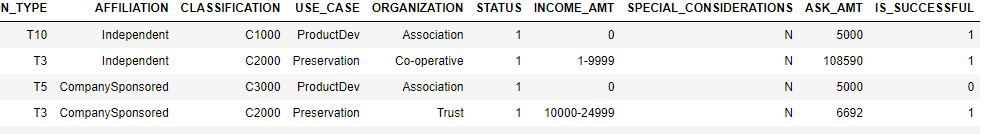
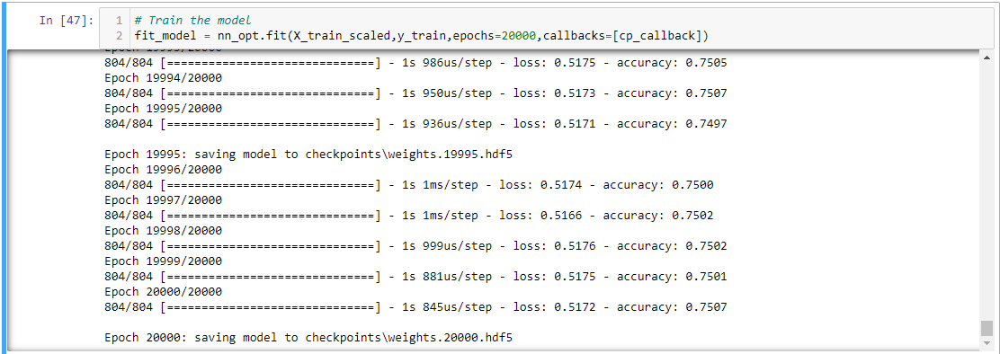

# Neural_Network_Charity_Analysis

## Overview
In this module we learned about neural networks and deep learning. For this challenge we built neural network models to analyze a dataset on charitable donations.
We used several parameters such as application type, income, and use case to determine whether or not a charity was successful.

## Results

### Data Preprocessing

Data Preprocessing:
    - The main variable that we wanted to test and predict was "IS_SUCCESSFUL"
    - Our main features were: 
        APPLICATION_TYPE
        AFFILIATION
        CLASSIFICATION
        USE_CASE
        ORGANIZATION
        STATUS
        INCOME_AMT
        SPECIAL_CONSIDERATIONS
        ASK_AMT
    - From the original data set, we also had the EIN number and the Name as columns. For the sake of the model these provided no benefit, so they were removed.

### Compiling, Training, and Evaluating:

For the first model we used 3 layers total, 2 layers with relu as the activation function and the output layer with sigmoid. The reul layers used 80 and 30 nodes while the sigmoid function had 1.

The first attempt was not as successful as we wanted, so some optimizations were made. Several attempts were made to optimize the model; different activation functions, node volumes, and layer numbers were attempted. There were also some attempts to remove columns that might be unimportant, but nothing significant was found. 

In the end, One model  worked that, through training, was able to reach 75% accuracy.

By using a 4 layer model with 2 tahn layers (100 and 70 nodes) and 2 sigmoid layers (40 and 1 nodes), the model was able to cross the 75% threshold. The only difficult part about this was that it took about 20000 epochs to achieve.

In total 3 attempts are recorded in the jupyter notebook file. An additional attempt was made using the Keras Tuner library; however despite picking a potential model it was still less prommissing than the previously mentioned model.

### Summary: 
Overall, I would have liked to have achieved a more accurate score with less epochs but there could have been several factors contributing to the loss. based on the tuner, I don't think there is much more that could have been done without further processing the data. Random Forest may have also been a potential alternative to neural networks in this case, especially as the input is tabular.